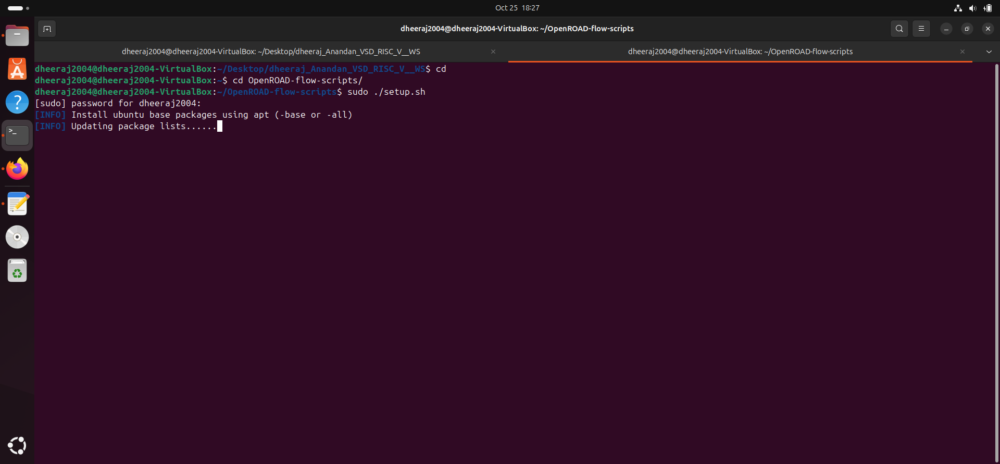
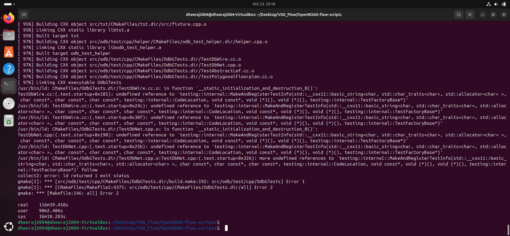

This document gives you a detailed description of how to install OpenRoad along with possible errors that you might come accross. It takes a long time to install so patience is also important.

# What is OpenRoad 
OpenROAD is a leading open-source project focused on automating the digital design process for integrated circuits, specifically enabling a complete flow from register transfer level (RTL) design to GDSII layout with minimal human intervention. Its main goal is to remove barriers related to cost, expertise, and risk in hardware design, providing tools and methodologies that enable system designers to efficiently create silicon chips using advanced technology nodes.

# Steps to install 
## 1. Clone the repository 

```bash 
git clone https://github.com/The-OpenROAD-Project/OpenROAD-flow-scripts.git
```
## 2. Change the directory and install dependencies

```bash 
cd OpenRoad-flow-scripts
sudo ./setup.sh
```



## 3. Build OpenRoad 

```bash 
./build_openroad.sh --local --threads 1 --openroad-args "-DENABLE_TESTS=OFF"
```


### Possible Error
While building OpenRoad using `./build_openroad.sh --local` or `./build_openroad.sh --local` you might get the error shown below:



To fix that the best fix is `./build_openroad.sh --local --threads 1 --openroad-args "-DENABLE_TESTS=OFF"`

# 4. Verifying installation
Once the OpenRoad application has been installed succeefully, you can confirm it by using these commands

```bash 
source ./env.sh
yosys -help  
openroad -help
```
- Yosys Confirmation


- OpenRoad Confirmation


# 5. Running OpenRoad Flow

```bash
cd flow
make
```


# 6. Launching the GUI

```bash
 make gui_final
```


Upon getting this user interface we can confirm that OpenRoad is installed. 


